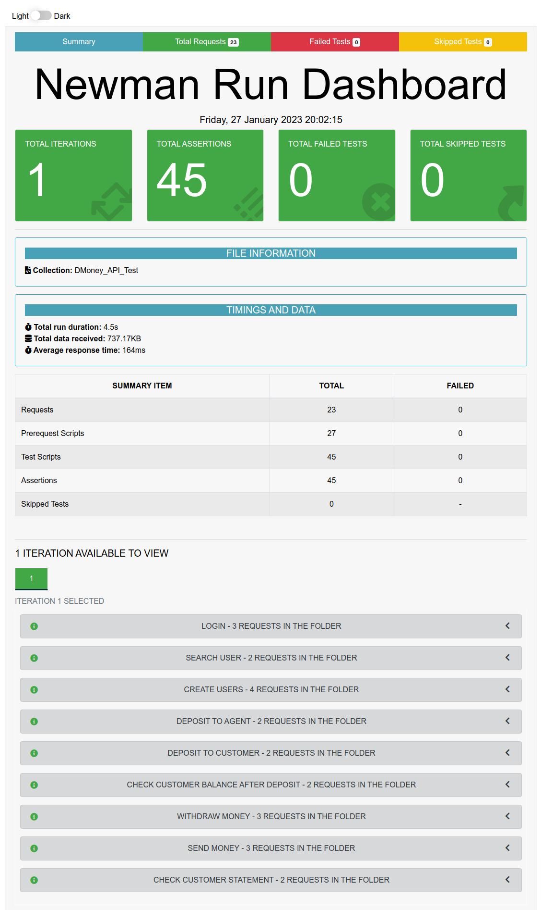

# DMONEY API Test Using Postman Newman

This project uses postman and newman to test [DMoney API](http://dmoney.roadtocareer.net/)

---
### API Documentation
- [Dmoney API Test](https://documenter.getpostman.com/view/12316264/2s8ZDeUKKL)


### Test Scenarios
- Login as admin
- User creations
- Deposit to agent
- Deposit to customer
- Withdraw money
- Send money
- Check customer statement


### Test Cases
The test cases are written in a standard test format
- [DMoney API **Test Cases**](https://docs.google.com/spreadsheets/d/1OfFaWJP-qYdu_CYSqt91RDGwIn1UYZ95KDtUym4f5NE/edit?usp=sharing)

### Bug Report
Written in a standard bug report format
- [DMoney API **Bug Report**](https://docs.google.com/spreadsheets/d/149HRZVbf2dHvSBUkl85E2cmW78DyTaUisMmo0xfrZso/edit?usp=sharing)
---

### Prerequisites
- Postman
- Nodejs
- VsCode

### How to run the project
1. Clone the repo
2. Open cmd in the root folder
3. Give the following commands

```
npm i
```
```
npm run test
```

### Generated reports

